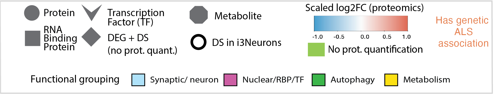

# Multi-omic network analysis of TDP-43 loss in iNeurons

[Interactive PPI network](https://www.ndexbio.org/viewer/networks/b343879d-8800-11f0-a218-005056ae3c32)

Analysis code and data accompanying our preprint: 

>Kozareva V, Liu Z, Blake K, Qi YA, Rollinson S, Seddighi S, Alsaidi M, Tsitkov S, Prudencio M, Petrucelli L, Dickson DW, Brown AL, Fratta P, Kim HJ, Taylor JP, Ward ME, Fraenkel E\*, Kargbo-Hill SE\*. Integrative multi-omic analysis links TDP-43-driven splicing defects to cascading proteomic disruption of ALS/FTD pathways. bioRxiv. DOI: https://doi.org/10.1101/2025.09.29.679403.

---

Code (Python and R) to reproduce main figures available in notebook format in `figures`. 

Scripts for differential and network analyses (used to generate intermediate data files in `data`) TBA. 